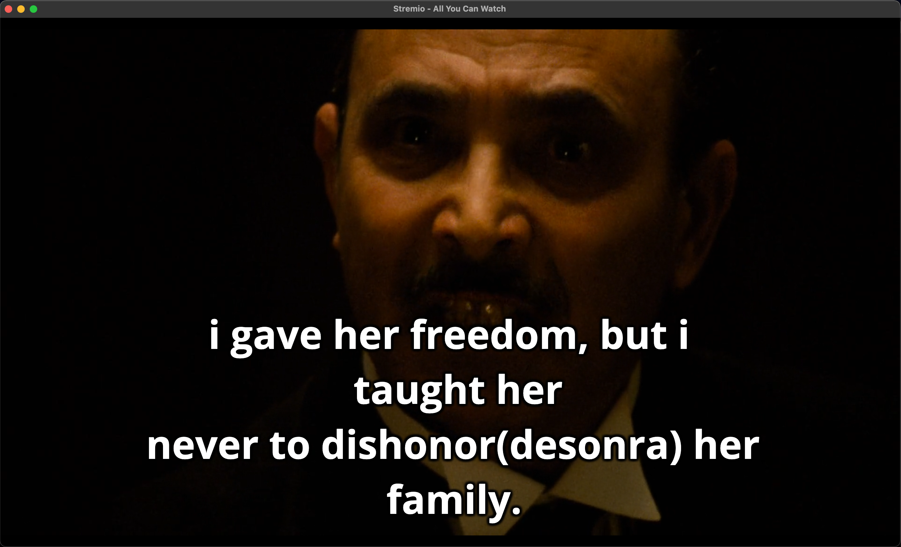

# Subtitles Stremio Addon
## (deprecated)

Subtitles addon for [Stremio](https://www.stremio.com/). 
  - [stremio-addon-sdk](https://github.com/Stremio/stremio-addon-sdk) was used to develop the application
  - [Stremio Github](https://github.com/Stremio)

### :low_brightness: How to use
  - Access: https://subtitles-stremio-addon.herokuapp.com/
  - Install
  - Enjoy!!

### :bookmark: How it works
Once installed, just open any movie or series and the subtitles will be there.

In addition to the many languages, there will also be a subtitle with some words translated to help Brazilians who are learning English. For example: "The blight(praga) came and we had to burn it".

To generate the translated subtitle, I created a [microservice](https://github.com/vmotta8/translate-ms)

### :clapper: Translated subtitle example

### :wrench: Tools and technologies
  - Nodejs
  - Typescript
  - Jest
  - Redis
  - Stremio Addon Sdk
  - Aws Lambda Functions
  - Open Subtitles Api
  - Translate Api

### Author
---
<a>
 
  
 <b>Vinicius Motta</b></a> <a>🤘</a>

